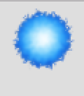

# ironman-dash
This project consists of building an endless runner video game using JavaScript and the Phaser game engine as a requirement for the Microverse JavaScript Capstone Project.
It is inspired by the simplicity of [Google's T-Rex Dino Game](http://www.trex-game.skipser.com/)

## Web App Screenshots
####
| Menu           | Game Play     |
| :------------- | :----------: |
| |    |

## Built With

- Javascript
- Html
- CSS
- [Phaser](https://phaser.io).
- [Leaderboard API Service](https://www.notion.so/microverse/Leaderboard-API-service-24c0c3c116974ac49488d4eb0267ade3)

## Game Design Document

## Background
This endless runner game is built purely on the inspiration and simplicity of [Google's T-Rex Dino Game](http://www.trex-game.skipser.com/) which can be played in Google Chrome in offline mode.

## Story
Ironman is a popular comic/movie hero in the Marvel Comic/Cinematic Universe. In this universe, Tony Stark is a billionaire who invents a metallic suit which can do almost anything from flying to shooting energy from his palms.

I employ Ironman in this game purely to dash (hence the name) and jump over platforms as quickly as he can to his laboratory to fix his suit which can no longer fly :wink:.

He has to avoid blue fireballs that appear randomly on platforms or get burnt and fall to his death in the process. Also he falls to his death if he misses a platform whiles jumping.

To make it a bit more interesting, he can jump one more time while in the air in case he mis-times a jump.

## Key Assets/Images

### Platforms
| Image           | Description    |
| :------------- | :----------: |
| | You can run and jump on these |

### Ironman

| Image           | Description    |
| :------------- | :----------: |
| | The main (and only) character in the game. He can do an extra jump in the air in case he gets into a fix :wink: |

### Fireball
| Image           | Description    |
| :------------- | :----------: |
| | Avoid these as they will burn him off the platform |

## How to Play

All you need is the main mouse button (left button). The game starts with Ironman running towards his laboratory. Help him jump onto platforms to avoid falling to his death. You may want to avoid the blue fireballs too as his suit can no longer help him fly or avoid getting burnt.
Don't worry, he still has an extra jump (left-click once more while he is in the air) in case he mis-times a jump.

## Live Demo

Click [here](https://ironman-dash.netlify.app/) to visit a live version of the web app.

## Getting Started

To get a local copy up and running follow these simple example steps.

### Prerequisites

- [yarn](https://yarnpkg.com/lang/en/).
- [Webpack](https://webpack.js.org/).
- [Jest](http://jestjs.io).

### Setup
- Clone the repository.
- Run `yarn install` in your terminal/command line to install dependencies.
- Run `yarn start` in your terminal/command line to start the game.

## Game Design Document

## Tests
Tests were done using the Jest testing framework. You can run tests in the project directory by:
- Running `yarn test` in your terminal/command line.

## Author

👤 **Christopher Amanor**

- Github: [@krys2fa](https://github.com/krys2fa)
- Twitter: [@krys2fa](https://twitter.com/krys2fa)
- Linkedin: [Christopher Amanor](https://www.linkedin.com/in/christopher-amanor/)

## 🤝 Contributing

Contributions, issues and feature requests are welcome!

Feel free to check the [issues page](https://github.com/krys2fa/ironman-dash/issues).

## Show your support

Kindly give this repository a ⭐️ if you like this project!

## Acknowledgments

- Project specifications by [Microverse Inc.](https://www.microverse.org)

- Game engine used was the [Phaser](https://phaser.io) game engine.

- API used for scoreboard was the [Leaderboard API Service](https://www.notion.so/microverse/Leaderboard-API-service-24c0c3c116974ac49488d4eb0267ade3).

- Assets used were gotten from [Sithjester's RMXP Resources](http://untamed.wild-refuge.net/rmxpresources.php) and [Open Game Art](https://opengameart.org/).

## 📝 License

This project is licensed under the MIT License.
